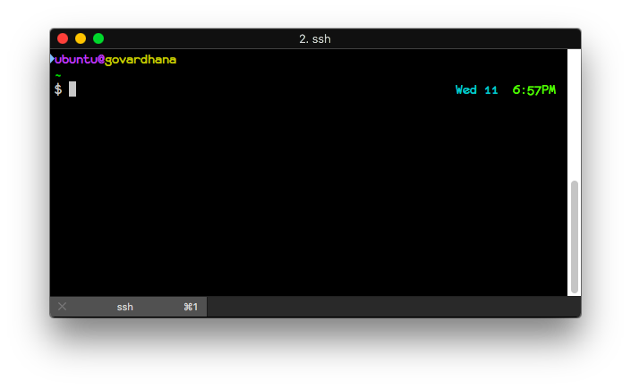
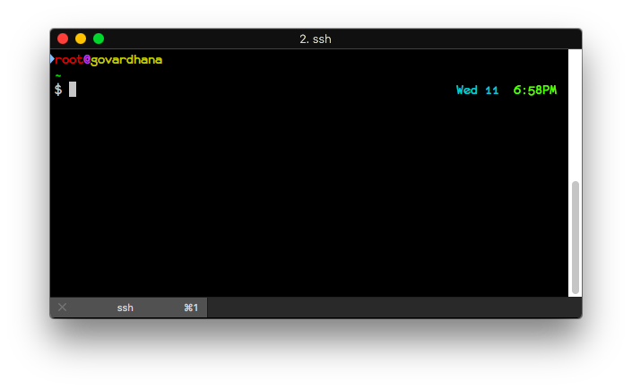

# Deva's dotfiles




## Installation

### Using Git and the bootstrap script

You can clone the repository wherever you want. (I like to keep it in `~/.dotfiles`) The bootstrap script will copy and/or symlink all the relevant files into place.

```bash
$ git clone https://gitlab.com/devap/dotfiles.git ~/.dotfiles && cd ~/.dotfiles && ./bootstrap
```

change shell to <desired shell>

```bash
$ chsh -s <shell>
$ chsh -s /usr/local/bin/fish
```


